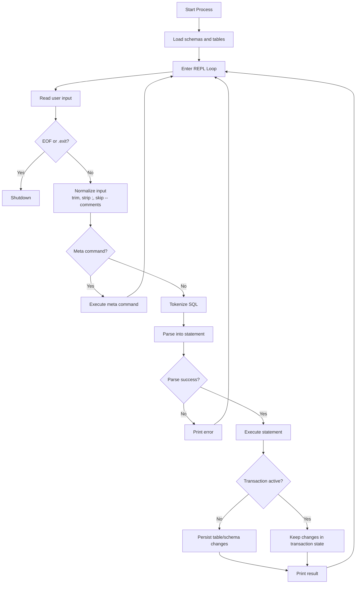

# Mash DB Workflow

## 1. Startup Flow

1. Process starts in `main.rs` and initializes in-memory state.
2. Schema registry is loaded from `schemas.json`.
3. Tables are created/loaded and stored in a map keyed by lowercased table name.
4. Transaction state is initialized (inactive by default).

## 2. REPL Input Flow

1. Print prompt: `db >`.
2. Read one line from stdin.
3. Exit loop on EOF.
4. Trim whitespace.
5. Ignore empty input.
6. Ignore SQL comment lines starting with `--`.
7. Strip a trailing semicolon if present.

## 3. Command Routing

1. If input starts with `.`, treat as meta command.
2. Supported meta commands are processed immediately (`.exit`, `.save`, `.load`, etc.).
3. Otherwise, treat input as SQL and pass to prepare/parse pipeline.

## 4. SQL Prepare and Parse Pipeline

1. Tokenize input into SQL tokens.
2. Parse tokens into statement variants (SELECT/INSERT/UPDATE/DELETE/DDL/transaction statements).
3. Validate syntax and required clause ordering.
4. Return a prepared statement or an error.

### Numeric Literal Handling

Tokenizer supports all of the following forms in SQL values:

1. Integers: `42`
2. Decimals: `19.99`
3. Signed numerics: `-12.5`, `+1`
4. Scientific notation: `1e6`, `-2.5E-3`
5. Leading-dot decimals: `.5`, `.5e2`

Standalone `.` still tokenizes as a dot token for qualified names like `table.column`.

## 5. Execution Flow

Prepared statements are executed by statement type:

1. DML: INSERT/SELECT/UPDATE/DELETE
2. DDL: CREATE TABLE, DROP TABLE, ALTER TABLE, TRUNCATE TABLE, SHOW TABLES
3. Transactions: BEGIN, COMMIT, ROLLBACK

Core execution behavior:

1. Resolve table names case-insensitively.
2. Resolve aliases for qualified columns.
3. Apply WHERE predicates.
4. For SELECT: apply JOIN, GROUP BY, HAVING, DISTINCT, ORDER BY, LIMIT/OFFSET.
5. For writes: mutate table rows, then save if transaction is not active.

## 6. Table/Data Path

1. Rows are represented by a fixed core (`id`, `username`, `email`) plus dynamic extras map for custom schema columns.
2. In-memory table owns row storage and indexes.
3. Query operators evaluate values through row accessors and extras map.
4. Sorting/distinct logic includes dynamic columns.

## 7. Transaction Flow (Snapshot-Based)

1. `BEGIN`: capture snapshot and mark transaction active.
2. Writes during active transaction mutate in-memory state.
3. `COMMIT`: finalize and persist current state.
4. `ROLLBACK`: restore snapshot and discard in-transaction changes.

## 8. Persistence Flow

1. Tables persist to per-table JSON files.
2. Schema registry persists to `schemas.json`.
3. On write statements, save is attempted with graceful error reporting (no panic).
4. On startup, saved schema/table files are loaded back into memory.

## 9. Error Handling Flow

1. Parse errors return prepare/statement errors without crashing REPL.
2. Runtime lookup failures are reported as user-facing errors.
3. I/O failures (stdin read, prompt flush, table save) are handled gracefully and logged.
4. REPL continues unless a fatal control command (`.exit`) is issued.

## 10. Diagram of DB Flow

